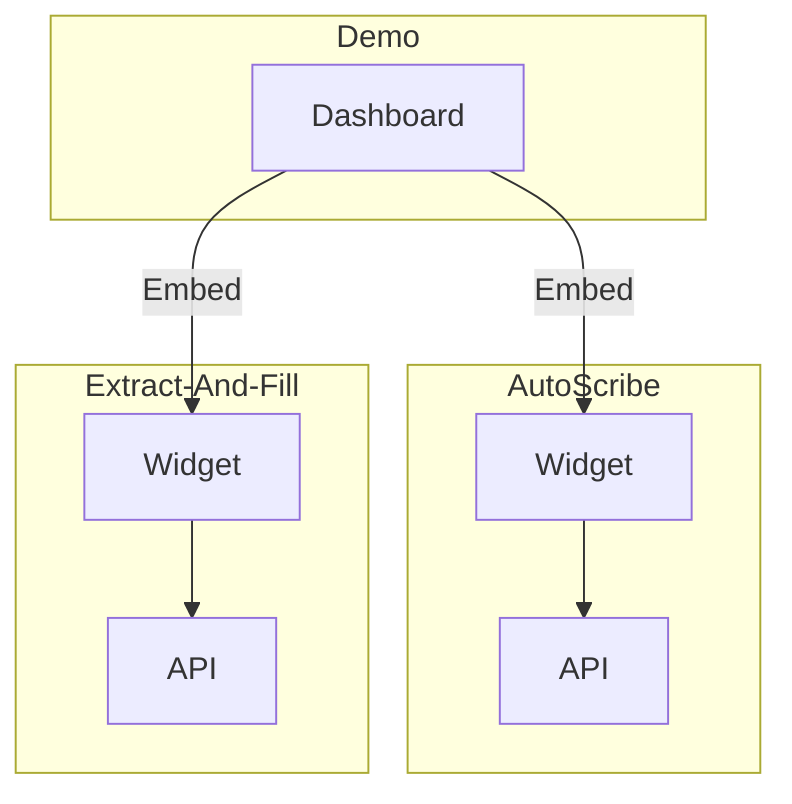

# VIKI AI

- [notebooks](./notebooks/)
- [autoscribe](./autoscribe/)
  - API: port 11000
  - Widget: port 11001
- [extract-and-fill](./extract-and-fill/)
  - API: port 12000
  - Widget: port 12001
- [formographer](./formographer/) - deprecated
- [ai-demo](./ai-demo/)
  - Dashboard: port 13001

## Quick start

Requirements:

- [Docker](https://docs.docker.com/get-docker/)
- [docker-compose](https://docs.docker.com/compose/install/) 2.x.x

```sh
# Authenticate to GCP
gcloud config set-project viki-dev-app-wsky
gcloud auth login
gcloud auth application-defailt login

# Run all projects
make run
# Or:
docker-compose up --build
```

## Service relationships


